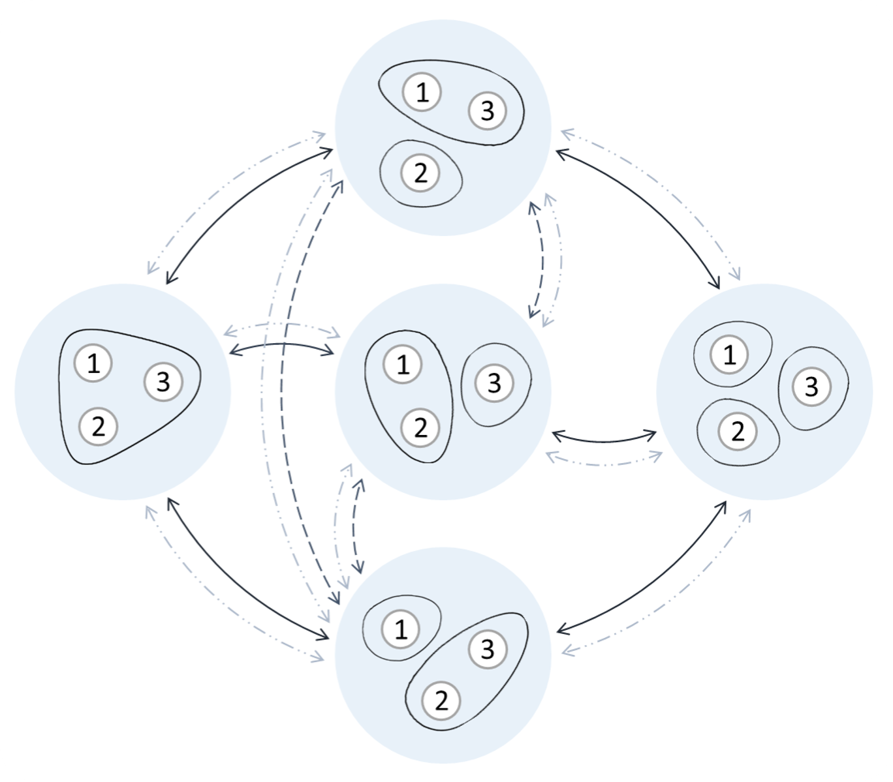
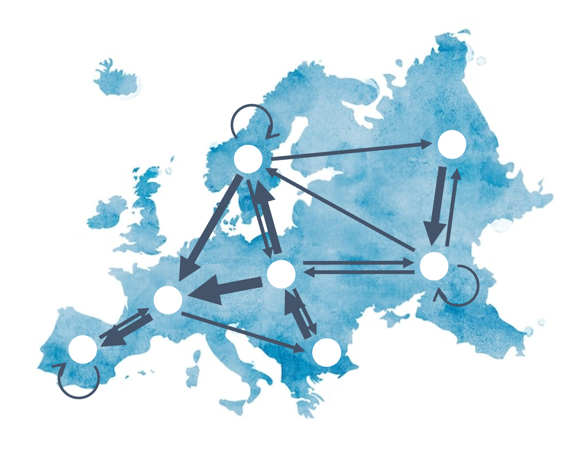
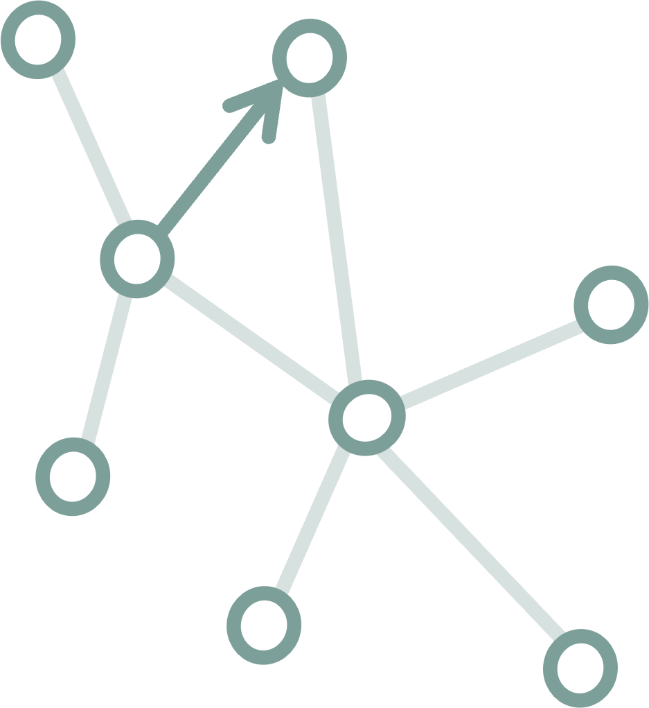

</img>

</img>

<br>

<div style="width:80%;margin: auto;">

# Marion Hoffman

<p style="font-size:1.3em">Mathematical Sociologist</p>
<p style="font-size:1.1em"><span style="color:#7D9F99">Social networks and network statistical models</span></p>
<p style="font-size:1.1em">Research Fellow | *Institute for Advanced Study in Toulouse, Toulouse School of Economics 🇫🇷 ([IAST](https://www.iast.fr/people/marion-hoffman))*</p>
<p style="font-size:1.1em">Postdoctoral Researcher | *Department of Sociology, University of Zurich 🇨🇭 ([UZH](https://www.suz.uzh.ch/de/institut/aboutus/mid_level/hoffman.html))*</p>

<br><br><br><br>

</img>

## About me {#about}

My research aims at furthering statistical methods for the analysis of social networks. I focus on the development of relational event models, exponential family models for social group data, and models for mobility networks. In my work, I use concepts from many different disciplines: sociology, statistics, psychology, economics, biology...

I have been working on several empirical studies using this type of methods, to understand: socioeconomic segregation, the link between depressive symptoms, the coordination of states at the UN General Assembly, the social dynamics in an elite organization in France...

Besides work, I try to live a life with a minimal impact on the environment. I love climbing, playing volleyball, watching rugby, doing pottery, and enjoying our beautiful nature.  

<br><br>


## Projects

<table style="background-color:#EBF1F0; border-radius:10px; width:100%;"><tr><td style="padding:10px;">

</img>


### Analyzing the determinants of social interactions


Face-to-face interactions are a key aspect of our social lives and understanding why they come about is an essential task to answer questions such as: Why do certain individuals interact more than others? Do our socioeconomic status or our environment affect who we can interact with?


<br>

In my PhD thesis and some continuing projects, I have designed statistical tools that are tailored to explain the emergence of face-to-face interactions. The main challenge is to take into account the punctual nature of interactions and their common occurence in groups rather than dyads. I have applied these methods to understand whether adolescents interact in socioeconomically homogenous groups and whether individuals with depressive symptoms preferred interacting in pairs rather than groups. 


</table>

<br>

<table style="background-color:#EBF1F0; border-radius:10px; width:100%;"><tr><td style="padding:10px;">

</img>

<div style="text-align: right"> 
### Modeling social groups

Groups are a core unit of social organization. The significance of group relations has long been documented and emphasized, as well their impact on individuals' cognition, social connections, and personal outcomes. But what drives the formation and evolution of groups? Which compositions are more likely to emerge?

<br>

Much of my methodological work has focused on extending statistical models for networks (i.e., dyadic relations) to social group data. I have developed two models with a readily available implementation of their estimation in R: DyNAM-i (Dynamic Network Actor Model for interactions, part of the [Goldfish](https://github.com/stocnet/goldfish) package) and ERPM (Exponential Random Partition model, in my [ERPM](https://github.com/marion-hoffman/erpm) package).

</div>

</table>

<br>

<table style="background-color:#EBF1F0; border-radius:10px; width:100%;"><tr><td style="padding:10px;">

</img>

### Understanding mobility networks

Mobility between jobs, occupations, or countries is a crucial topic in sociological research. In many types of mobility, individuals’ moves between states or locations are endogenous. Because of this endogeneity, mobility has increasingly been represented as a network, where nodes represent jobs, occupations, or geographical locations, and edges represent the flows of individuals between those. What determines the structure of these networks?

<br>

I am working on developing a novel statistical framework proposed by Per Block for the analysis of mobility networks. The goal of this model is to test endogenous mechanisms explaining mobility flows, such as bandwagon effects. The model can already be used using the R package [MoNAn](https://github.com/stocnet/MoNAn).

</table>

<br>


## Experience

</img>

2022 - present | **Postdoctoral Researcher** Department of Sociology, University of Zurich

2021 - present | **Research Fellow** Institute for Advanced Study in Toulouse, University of Toulouse 1 Capitole

2016 - 2021 | **PhD** Social Networks Lab, ETH Zurich

2015 - 2016 | **MSc** Network Industries and Digital Economics, Paris-Saclay University

2012 - 2016 | **MSc** Science and Engineering, Supélec (now CentraleSupélec)

[See resume](doc/CV_2024_short.pdf)

<br>

## Teaching

2023 - present | **Graph Analysis** (lecturer and coordinator) at the Toulouse School of Economics

2022 - present | Guest lecturer for courses on **Relational Event Models** and **Exponential Random Graph Models** at the Geneva Graduate Insitute and at the University of Salerno

2020 | **Network Modeling** (teaching assistant) at ETH Zürich

2017 - present | Teaching workshops for the **R packages [Goldfish](https://github.com/stocnet/goldfish) and [RSiena](https://github.com/stocnet/rsiena)**


<br>


## Publications 

<table style="background-color:#EBF1F0; border-radius:10px; width:100%;"><tr><td style="padding:10px;">

[The role of selection in socioeconomic homophily: Evidence from an adolescent summer camp](https://www.sciencedirect.com/science/article/pii/S0378873323000291)<br>M Hoffman & T Chabot<br>*Social Networks*, 2023

[Modeling partitions of individuals](https://journals.sagepub.com/doi/abs/10.1177/00811750221145166)<br>
M Hoffman, P Block, TAB Snijders<br>
*Sociological Methodology*, 2023

[Social network-based distancing strategies to flatten the COVID-19 curve in a post-lockdown world](https://www.nature.com/articles/s41562-020-0898-6)<br>
P Block, M Hoffman, IJ Raabe, JB Dowd, C Rahal, R Kashyap, MC Mills<br>
*Nature Human Behaviour*, 2020

[A model for the dynamics of face-to-face interactions in social groups](https://www.cambridge.org/core/journals/network-science/article/model-for-the-dynamics-of-facetoface-interactions-in-social-groups/5EE32074370B3C443EE9AA2519602338)<br>
M Hoffman, P Block, T Elmer, C Stadtfeld<br>
*Network Science*, 2020

[See all publications and presentations >>](publications.html)

</td></tr></table>

<br>

</img>

## Contact {#contact}

If you want to get in touch, you can reach me at: [marion.hoffman@iast.fr](mailto:marion.hoffman@iast.fr) or [hoffman@soziologie.uzh.ch](mailto:hoffman@soziologie.uzh.ch)


<br><br><br>

<div style="text-align: left"> <font size="2"> Website created with the help of [Marijn Keijzer](https://marijnkeijzer.github.io/), last update on 13/05/2024. </font> </div>


</div>

```{js,echo=F}
$(function() {
	// Get page title
  	var pageTitle = $("title").text("Marion Hoffman");
	});
```
